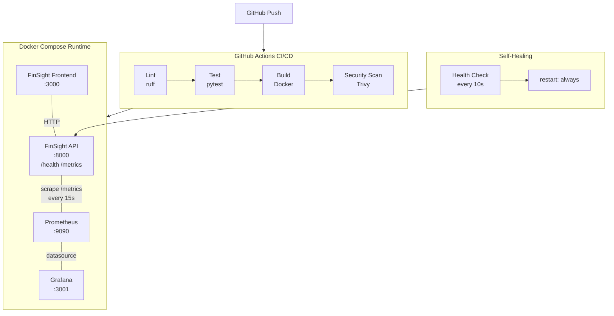

# PipelineX Lite

Production infrastructure wrapper around [FinSight Lite](https://github.com/idoroe/Finsight-Lite) — CI/CD, monitoring, and self-healing.

> Most portfolio projects end at "it works on my laptop." PipelineX is everything that comes after — the production infrastructure that makes FinSight reliable, observable, and automatically recoverable.

---

## Architecture



**GitHub push** triggers a 4-stage GitHub Actions workflow (lint → test → build → Trivy security scan). **Production** runs via Docker Compose with the FinSight API, frontend, Prometheus (scraping `/metrics` every 15s), and Grafana (auto-provisioned dashboards). Docker health checks + restart policies enable **self-healing**.

---

## Quick Start

```bash
# Clone with submodule
git clone --recurse-submodules https://github.com/idoroe/PipelineX.git
cd PipelineX

# Start the full stack
docker compose up --build
```

| Service    | URL                   | Description                    |
|------------|-----------------------|--------------------------------|
| API        | http://localhost:8000 | FinSight REST API              |
| Frontend   | http://localhost:3000 | FinSight UI                    |
| Prometheus | http://localhost:9090 | Metrics collection             |
| Grafana    | http://localhost:3001 | Dashboards (no login required) |

### Verify everything is running

```bash
# API health
curl http://localhost:8000/health

# Prometheus metrics
curl http://localhost:8000/metrics

# Check Prometheus targets
curl -s http://localhost:9090/api/v1/targets | python3 -m json.tool
```

---

## Demo: Failure Recovery

This demonstrates Docker's self-healing. The script kills the API, watches it go down, and observes automatic recovery — all visible on the Grafana dashboard.

```bash
# 1. Make sure the stack is running
docker compose up -d

# 2. Generate some traffic so Grafana has data
bash scripts/load_test.sh 30

# 3. Run the failure recovery demo
bash scripts/failure_demo.sh
```

**What happens:**
1. Script confirms API is healthy
2. Generates 20 requests to populate dashboard
3. Kills the API process inside the container
4. Polls every 2s — API recovers in ~2–15 seconds
5. Points you to Grafana to see the incident

Open **http://localhost:3001** and watch:
- **Container Status** panel drops to DOWN (red)
- **Request Rate** briefly flatlines
- Both recover automatically — no human intervention

---

## CI/CD Pipeline

The GitHub Actions workflow (`.github/workflows/ci.yml`) runs on every push and PR to `main`:

| Stage          | Tool   | Description                                     |
|----------------|--------|-------------------------------------------------|
| **Lint**       | ruff   | Static analysis on API and ML code              |
| **Test**       | pytest | Unit tests for the FinSight API                 |
| **Build**      | Docker | Builds API and Frontend images                  |
| **Security**   | Trivy  | Scans images for CRITICAL and HIGH CVEs         |

Stages run sequentially: lint → test → build → security scan.

---

## Observability

### Prometheus

- Scrapes `api:8000/metrics` every **15 seconds**
- PipelineX adds a [metrics overlay](overlay/metrics.py) using `prometheus-fastapi-instrumentator` — FinSight itself is unmodified
- Config: [`monitoring/prometheus/prometheus.yml`](monitoring/prometheus/prometheus.yml)

### Grafana Dashboard

Auto-provisioned on startup with **5 panels**:

| Panel                    | Type       | Query                                                                 |
|--------------------------|------------|-----------------------------------------------------------------------|
| Request Rate             | Time Series| `rate(http_requests_total[1m])`                                       |
| Error Rate (5xx)         | Stat       | `sum(rate(http_requests_total{status=~"5.."}[5m]))`                   |
| P95 Latency              | Time Series| `histogram_quantile(0.95, rate(http_request_duration_seconds_bucket[5m]))` |
| Container Status         | Stat       | `up{job="finsight-api"}`                                              |
| Request Duration Heatmap | Heatmap    | `sum(increase(http_request_duration_seconds_bucket[5m])) by (le)`     |

Dashboard JSON: [`monitoring/grafana/dashboards/finsight.json`](monitoring/grafana/dashboards/finsight.json)

---

## Self-Healing

The API service is configured with:

```yaml
healthcheck:
  test: ["CMD", "curl", "-f", "http://localhost:8000/health"]
  interval: 10s
  timeout: 5s
  retries: 3
  start_period: 15s
restart: always
```

If the API process crashes, Docker automatically restarts the container. The health check verifies `/health` returns 200 every 10 seconds.

---

## Project Structure

```
PipelineX/
├── .github/workflows/ci.yml          # 4-stage CI/CD pipeline
├── monitoring/
│   ├── prometheus/prometheus.yml      # Prometheus scrape config
│   └── grafana/
│       ├── provisioning/
│       │   ├── datasources/           # Auto-connect to Prometheus
│       │   └── dashboards/            # Auto-load dashboard JSON
│       └── dashboards/finsight.json   # 5-panel Grafana dashboard
├── overlay/metrics.py                 # Prometheus /metrics instrumentation
├── scripts/
│   ├── check_finsight.sh              # Verify FinSight dependency
│   ├── failure_demo.sh                # Self-healing demo
│   └── load_test.sh                   # Traffic generator
├── finsight/                          # FinSight Lite (git submodule)
├── docker-compose.yml                 # Full stack
├── docker-compose.prod.yml            # Production overrides
├── Dockerfile.api                     # API image with metrics overlay
└── Dockerfile.frontend                # Frontend image
```

---

## Portfolio Write-up

**Title:** PipelineX
**Tags:** DevOps, Docker, GitHub Actions, Prometheus, Grafana, Trivy
**Role:** DevOps / SRE Engineer
**Category:** DevOps

**Problem:** Most portfolio projects end at "it works on my laptop." PipelineX is everything that comes after — the production infrastructure that makes FinSight reliable, observable, and automatically recoverable.

**Tech Stack:** Docker, Docker Compose, GitHub Actions, Prometheus, Grafana, Trivy, Shell Scripting

**Architecture:** GitHub push triggers a 4-stage GitHub Actions workflow (lint → test → build → Trivy security scan). Production runs via Docker Compose with the FinSight API, frontend, Prometheus (scraping /metrics every 15s), and Grafana (auto-provisioned dashboards). Docker health checks + restart policies enable self-healing.

**Key Challenges:** Auto-provisioning the Grafana dashboard so it loads on boot with zero manual configuration, and creating a compelling failure recovery demo that visually captures the full incident lifecycle on the dashboard.

**What I Shipped:**
- 4-stage CI/CD pipeline via GitHub Actions
- Prometheus + Grafana monitoring stack with 5 auto-provisioned dashboard panels
- Docker health checks with automatic container restart policies
- Live failure recovery demo script

**Impact:** The demo says it all: kill the API container, the dashboard spikes red, and 10 seconds later it's green again — automatically. No human intervention needed.

**Story:**

> Most portfolio projects end at "it works on my laptop." PipelineX is everything that comes after — the production infrastructure that makes FinSight reliable, observable, and automatically recoverable. It wraps the FinSight API in a full CI/CD pipeline (lint, test, build, security scan), adds Prometheus metrics collection, and surfaces everything through a Grafana dashboard. Docker health checks and restart policies mean the system self-heals when containers crash. The demo says it all: I kill the API container, the dashboard spikes red, and 10 seconds later it's green again — automatically.

---

## What I'd Add Next

- **Alertmanager** — Slack/email notifications when containers go unhealthy
- **Log aggregation** — ELK or Loki stack for centralized logging
- **Nginx reverse proxy** — Single entry point with TLS termination
- **Horizontal scaling** — Docker Swarm or Kubernetes for multi-replica API
- **Blue/green deploys** — Zero-downtime deployment strategy
- **Rate limiting** — API throttling via middleware or reverse proxy
- **Secrets management** — Vault or SOPS for credential rotation
- **SLA dashboard** — Uptime tracking with error budget visualization
